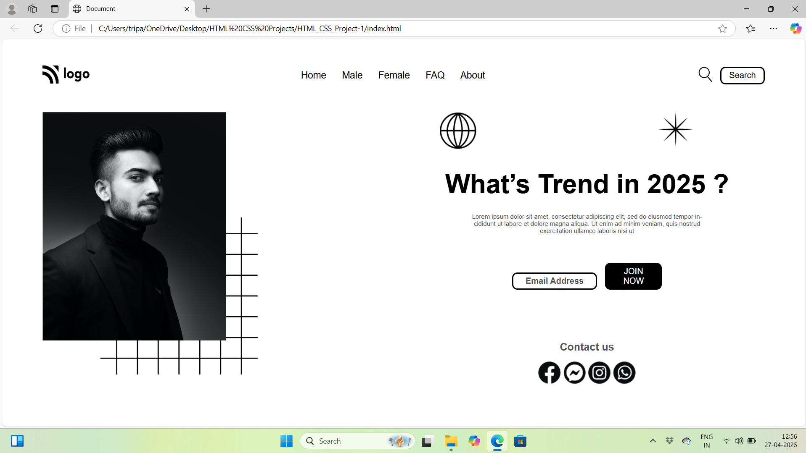

# Project 1 | Fashion Trends A static page of 

A statc web page of Fashion Trends using HTML CSS.


## Screenshots




## What I learned from this Project

- This project gave me good learning experience about how html and css works. 
- I learned how to use HTML and CSS to create a beautiful website.
- I learned about the ways of positioning elements in the HTML and CSS.


## Deployment

To deploy this project run

```bash
  html-css-project-1-theta.vercel.app
```

## Time taken to finish this project
- 4 hour to complete it.
